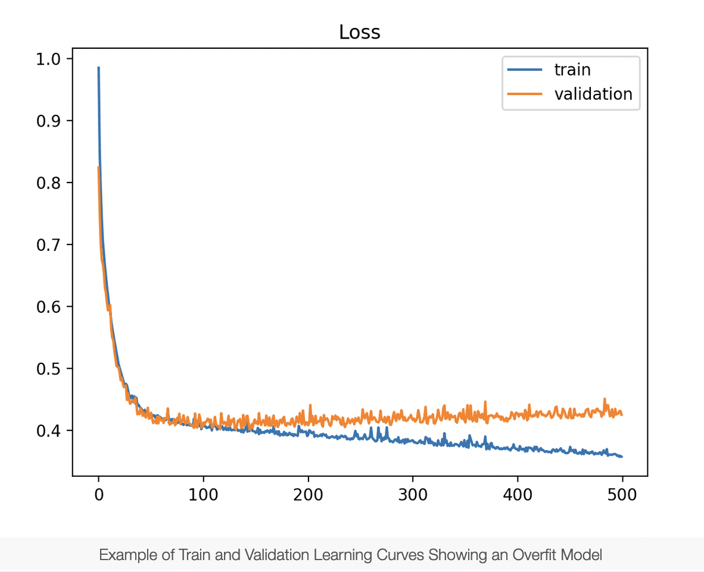
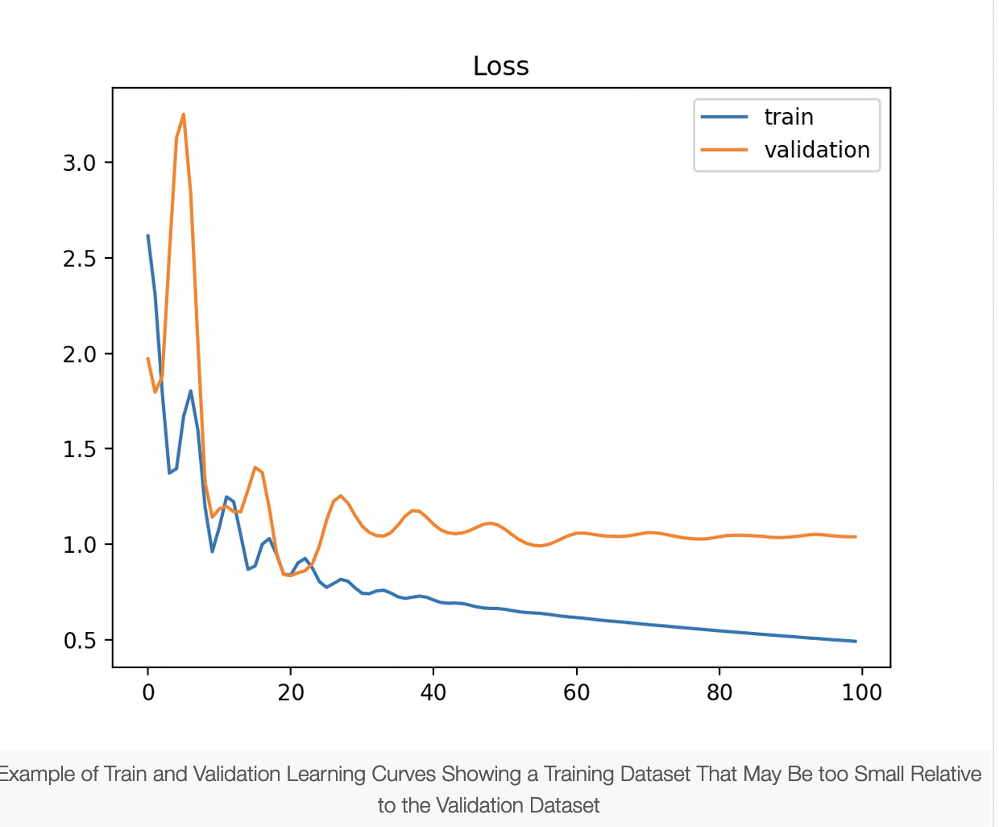

# Notes from Labs and Readings

### Readings Notes
## Preventing overfitting

Copied from [here](https://cloud.google.com/bigquery-ml/docs/preventing-overfitting)

A common pitfall when training a BigQuery ML model is overfitting. Overfitting occurs when the model matches the training data too closely, causing it to perform poorly on new data. BigQuery ML supports two methods for preventing overfitting: early stopping and regularization.

To learn how to modify the options described below, see the CREATE MODEL statement.

### Early stopping

Early stopping is the default option for overfitting prevention in BigQuery ML. When early stopping is enabled, the loss on the holdout data is monitored during training, and training is halted once the loss improvement in the latest iteration falls below a threshold. Since the holdout data is not used during training, it is a good estimate of the model's loss on new data. The `early_stop`, `min_rel_progress`, `data_split_method`, and `data_split_eval_fraction` options control the behavior of early stopping.
### Regularization

Regularization keeps the model weights from growing too large, preventing the model from matching the training data too closely. BigQuery ML supports two methods for controlling the size of the model weights: L1 regularization and L2 regularization.

By default, the values of `l1_reg` and `l2_reg are zero`, which disables regularization. On some datasets, setting positive values for `l1_reg` and `l2_reg` will improve the trained model's performance on new data. The best values for the regularization parameters are typically found through trial-and- error, and it is common to experiment with values across several orders of magnitude (for example, 0.01, 0.1, 1, 10, and 100).

Here is some general advice on using regularization:
- If you are experimenting with the regularization parameters, try disabling early stopping so that the effect of regularization is clear.
- If the number of features is large compared to the size of the training set, try large values for the regularization parameters. The risk of overfitting is greater when there are only a few observations per feature.
- If you are concerned that many features may be irrelevant for predicting the label, try setting `l1_reg` to be larger than `l2_reg` and vice versa. There is theoretical evidence that L1 regularization works better when many features are irrelevant.

Another benefit of L1 regularization is that it tends to set many model weights to exactly zero, which is helpful for identifying the most relevant features and training a compact model.

## Learning Curves in ML
Information about learning curves below have been obtained from [here](https://machinelearningmastery.com/learning-curves-for-diagnosing-machine-learning-model-performance/#:~:text=A%20learning%20curve%20is%20a,from%20a%20training%20dataset%20incrementally.&text=Learning%20curves%20are%20plots%20that,time%20in%20terms%20of%20experience)

#### underfitting_1

#### underfitting_2

#### overfitting

#### under_represented_training_dataset

#### under_represented_validation_dataset_1

#### under_represented_validation_dataset_2

#### goodfit
