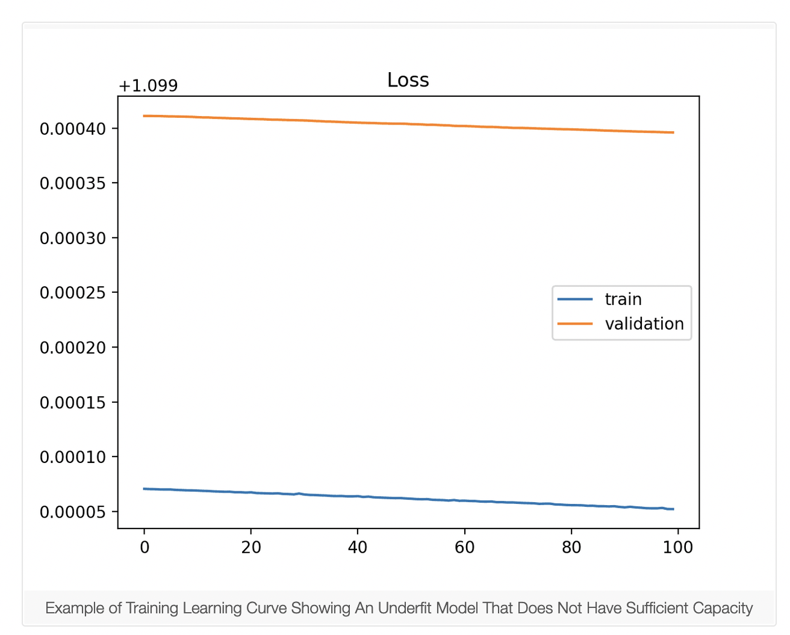
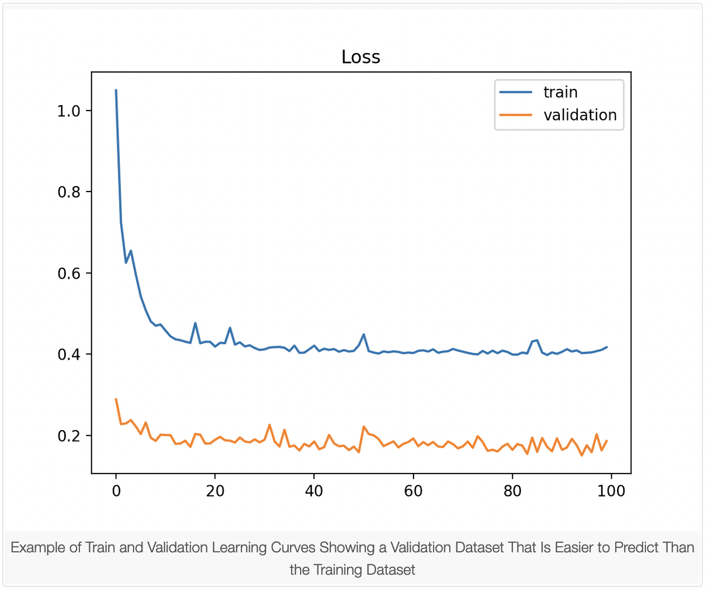
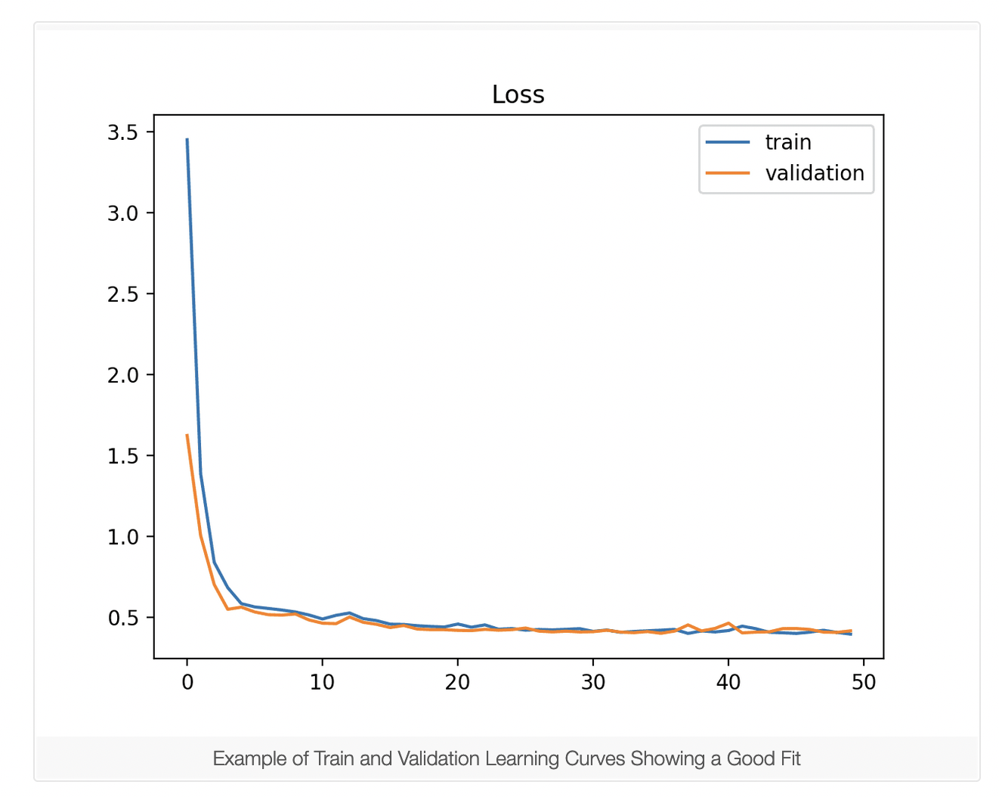

# Notes from Labs and Readings

### Readings Notes
## Preventing overfitting

Copied from [here](https://cloud.google.com/bigquery-ml/docs/preventing-overfitting)

A common pitfall when training a BigQuery ML model is overfitting. Overfitting occurs when the model matches the training data too closely, causing it to perform poorly on new data. BigQuery ML supports two methods for preventing overfitting: early stopping and regularization.

To learn how to modify the options described below, see the CREATE MODEL statement.

### Early stopping

Early stopping is the default option for overfitting prevention in BigQuery ML. When early stopping is enabled, the loss on the holdout data is monitored during training, and training is halted once the loss improvement in the latest iteration falls below a threshold. Since the holdout data is not used during training, it is a good estimate of the model's loss on new data. The `early_stop`, `min_rel_progress`, `data_split_method`, and `data_split_eval_fraction` options control the behavior of early stopping.
### Regularization

Regularization keeps the model weights from growing too large, preventing the model from matching the training data too closely. BigQuery ML supports two methods for controlling the size of the model weights: L1 regularization and L2 regularization.

By default, the values of `l1_reg` and `l2_reg are zero`, which disables regularization. On some datasets, setting positive values for `l1_reg` and `l2_reg` will improve the trained model's performance on new data. The best values for the regularization parameters are typically found through trial-and- error, and it is common to experiment with values across several orders of magnitude (for example, 0.01, 0.1, 1, 10, and 100).

Here is some general advice on using regularization:
- If you are experimenting with the regularization parameters, try disabling early stopping so that the effect of regularization is clear.
- If the number of features is large compared to the size of the training set, try large values for the regularization parameters. The risk of overfitting is greater when there are only a few observations per feature.
- If you are concerned that many features may be irrelevant for predicting the label, try setting `l1_reg` to be larger than `l2_reg` and vice versa. There is theoretical evidence that L1 regularization works better when many features are irrelevant.

Another benefit of L1 regularization is that it tends to set many model weights to exactly zero, which is helpful for identifying the most relevant features and training a compact model.

## Learning Curves in ML
Information about learning curves below have been obtained from [here](https://machinelearningmastery.com/learning-curves-for-diagnosing-machine-learning-model-performance/#:~:text=A%20learning%20curve%20is%20a,from%20a%20training%20dataset%20incrementally.&text=Learning%20curves%20are%20plots%20that,time%20in%20terms%20of%20experience)

#### underfitting_1


#### underfitting_2


#### overfitting


#### under_represented_training_dataset


#### under_represented_validation_dataset_1


#### under_represented_validation_dataset_2


#### goodfit



### learning_rate.ipynb

[learning_rate.ipynb](./learning_rate.ipynb)
Downloaded from [here](https://github.com/GoogleCloudPlatform/training-data-analyst/blob/master/courses/machine_learning/deepdive2/art_and_science_of_ml/labs/learning_rate.ipynb)

## Introduction 

In this notebook, you will observe learning curve change. You will use the Keras Sequential Model to build an ML model to predict housing prices.

A learning curve is a plot of model learning performance over experience or time.

Learning curves are a widely used diagnostic tool in machine learning for algorithms that learn from a training dataset incrementally. The model can be evaluated on the training dataset and on a hold out validation dataset after each update during training and plots of the measured performance can created to show learning curves. Reviewing learning curves of models during training can be used to diagnose problems with learning, such as an underfit or overfit model, as well as whether the training and validation datasets are suitably representative.

Adam is an optimization algorithm that can be used instead of the classical stochastic gradient descent procedure to update network weights iterative based in training data. [How to use Learning Curves to Diagnose Machine Learning Model Performance](https://machinelearningmastery.com/learning-curves-for-diagnosing-machine-learning-model-performance/#:~:text=A%20learning%20curve%20is%20a,from%20a%20training%20dataset%20incrementally.&text=Learning%20curves%20are%20plots%20that,time%20in%20terms%20of%20experience).

1. Copying from cloud storage to juypter notebook directory
```
!gsutil cp gs://cloud-training-demos/feat_eng/housing/housing_pre-proc.csv ../data
```
2. Training, validation, test data split
```
train, test = train_test_split(housing_df, test_size=0.2)
train, val = train_test_split(train, test_size=0.2)

print(len(train), 'train examples')
print(len(val), 'validation examples')
print(len(test), 'test examples')

train.to_csv('../data/housing-train.csv', encoding='utf-8', index=False)
val.to_csv('../data/housing-val.csv', encoding='utf-8', index=False)
test.to_csv('../data/housing-test.csv', encoding='utf-8', index=False)
```
3. Create, compile and fit keras sequential model
```
# Model create

feature_layer = tf.keras.layers.DenseFeatures(feature_columns, dtype = 'float64')

model = tf.keras.Sequential([
    feature_layer,
    layers.Dense(12, input_dim = 8, activation = 'relu'),
    layers.Dense(8, activation = 'relu'),
    layers.Dense(1, activation = 'linear', name = 'median_house_value')
])

# Model compile
opt = keras.optimizers.Adam(learning_rate = 0.5)
model.compile(optimizer = opt,
             loss = 'mse',
             metrics = ['mse'])

# Model Fit
history = model.fit(train_ds,
                    validation_data=val_ds,
                    epochs=32)
```
4. Plotting Loss curves `important`
```
def plot_curves(history, metrics):
    nrows = 1
    ncols = 2
    fig = plt.figure(figsize=(10, 5))

    for idx, key in enumerate(metrics):  
        ax = fig.add_subplot(nrows, ncols, idx+1)
        plt.plot(history.history[key])
        plt.plot(history.history['val_{}'.format(key)])
        plt.title('model {}'.format(key))
        plt.ylabel(key)
        plt.xlabel('epoch')
        plt.legend(['train', 'validation'], loc='upper left'); 
plot_curves(history, ['loss', 'mse'])
```

### export_data_from_bq_to_gcs.ipynb

[export_data_from_bq_to_gcs.ipynb](./export_data_from_bq_to_gcs.ipynb)
Downloaded from [here](https://github.com/GoogleCloudPlatform/training-data-analyst/blob/master/courses/machine_learning/deepdive2/art_and_science_of_ml/labs/export_data_from_bq_to_gcs.ipynb)

1. Create cloud bucket using gsutils
```
gsutil mb gs://me_oh_my_i_enjoyed_that
```
2. Creating `BigQuery` dataset using python
```
bq = bigquery.Client(project = PROJECT)
dataset = bigquery.Dataset(bq.dataset("taxifare"))

try:
    bq.create_dataset(dataset)
    print("Dataset created")
except:
    print("Dataset already exists")
```
3. Splitting data set in `BigQuery` using `ABS(MOD(FARM_FINGERPRINT()`
```
Original dataset size = 1,075,800,87

Training Dataset Size = 1,094,492
ABS(MOD(FARM_FINGERPRINT(CAST(pickup_datetime AS STRING)), 1000)) = 1

Make the validation dataset be 1/10 the size of the training dataset
Validation Dataset Size = 108,047
WHERE ABS(MOD(FARM_FINGERPRINT(CAST(pickup_datetime AS STRING)), 10000)) = 2
```
3. Using `bash` to export the `BigQuery` tables as CSV files
```
%%bash

echo "Deleting current contents of $OUTDIR"
gsutil -m -q rm -rf $OUTDIR

echo "Extracting training data to $OUTDIR"
bq --location=US extract \
   --destination_format CSV  \
   --field_delimiter "," --noprint_header \
   taxifare.feateng_training_data \
   $OUTDIR/taxi-train-*.csv

echo "Extracting validation data to $OUTDIR"
bq --location=US extract \
   --destination_format CSV  \
   --field_delimiter "," --noprint_header \
   taxifare.feateng_valid_data \
   $OUTDIR/taxi-valid-*.csv

gsutil ls -l $OUTDIR
```

then to check on them

```
!gsutil cat gs://$BUCKET/taxifare/data/taxi-train-000000000000.csv | head -2
```

### hyperparameter_tuning.ipynb

[hyperparameter_tuning.ipynb](./hyperparameter_tuning.ipynb)
Downloaded from [here](https://github.com/GoogleCloudPlatform/training-data-analyst/blob/master/courses/machine_learning/deepdive2/art_and_science_of_ml/labs/hyperparameter_tuning.ipynb)

# Performing the Hyperparameter tuning

- [Google Documentation Link](https://cloud.google.com/ai-platform/training/docs/hyperparameter-tuning-overview)
- Easier notebook to [follow](https://www.kaggle.com/tboyle10/hyperparameter-tuning) from the [3rd reading](../readings/file-resources-readings-3-en.pdf) 

**Learning Objectives**
1. Learn how to use `cloudml-hypertune` to report the results for Cloud hyperparameter tuning trial runs
2. Learn how to configure the `.yaml` file for submitting a Cloud hyperparameter tuning job
3. Submit a hyperparameter tuning job to Cloud AI Platform

## Introduction

Let's see if we can improve upon that by tuning our hyperparameters.

Hyperparameters are parameters that are set *prior* to training a model, as opposed to parameters which are learned *during* training. 

These include learning rate and batch size, but also model design parameters such as type of activation function and number of hidden units.

Here are the four most common ways to finding the ideal hyperparameters:
1. Manual
2. Grid Search
3. Random Search
4. Bayesian Optimzation

**1. Manual**

Traditionally, hyperparameter tuning is a manual trial and error process. A data scientist has some intution about suitable hyperparameters which they use as a starting point, then they observe the result and use that information to try a new set of hyperparameters to try to beat the existing performance. 

Pros
- Educational, builds up your intuition as a data scientist
- Inexpensive because only one trial is conducted at a time

Cons
- Requires alot of time and patience

**2. Grid Search**

On the other extreme we can use grid search. Define a discrete set of values to try for each hyperparameter then try every possible combination. 

Pros
- Can run hundreds of trials in parallel using the cloud
- Gauranteed to find the best solution within the search space

Cons
- Expensive

**3. Random Search**

Alternatively define a range for each hyperparamter (e.g. 0-256) and sample uniformly at random from that range. 

Pros
- Can run hundreds of trials in parallel using the cloud
- Requires less trials than Grid Search to find a good solution

Cons
- Expensive (but less so than Grid Search)

**4. Bayesian Optimization**

Unlike Grid Search and Random Search, Bayesian Optimization takes into account information from  past trials to select parameters for future trials. The details of how this is done is beyond the scope of this notebook, but if you're interested you can read how it works here [here](https://cloud.google.com/blog/products/gcp/hyperparameter-tuning-cloud-machine-learning-engine-using-bayesian-optimization). 

Pros
- Picks values intelligenty based on results from past trials
- Less expensive because requires fewer trials to get a good result

Cons
- Requires sequential trials for best results, takes longer

**AI Platform HyperTune**

AI Platform HyperTune, powered by [Google Vizier](https://ai.google/research/pubs/pub46180), uses Bayesian Optimization by default, but [also supports](https://cloud.google.com/ml-engine/docs/tensorflow/hyperparameter-tuning-overview#search_algorithms) Grid Search and Random Search. 


When tuning just a few hyperparameters (say less than 4), Grid Search and Random Search work well, but when tunining several hyperparameters and the search space is large Bayesian Optimization is best.

1. It will list all the files in the mentioned directory with a long listing format
```
!ls -la taxifare/trainer
```

2. To use hyperparameter tuning in your training job you must perform the following steps:

 - Specify the hyperparameter tuning configuration for your training job by including a HyperparameterSpec in your TrainingInput object.

 - Include the following code in your training application:
  - Parse the command-line arguments representing the hyperparameters you want to tune, and use the values to set the hyperparameters for your training trial. 
  - Add your hyperparameter metric to the summary for your graph.
  - To submit a hyperparameter tuning job, we must modify `model.py` and `task.py` to expose any variables we want to tune as command line arguments.

3. How to write files from `python` using notebook `magic` bash command
```
%%writefile taxifare/trainer/task.py
```

4. ### Create config.yaml file

Specify the hyperparameter tuning configuration for your training job
Create a HyperparameterSpec object to hold the hyperparameter tuning configuration for your training job, and add the HyperparameterSpec as the hyperparameters object in your TrainingInput object.

In your HyperparameterSpec, set the hyperparameterMetricTag to a value representing your chosen metric. If you don't specify a hyperparameterMetricTag, AI Platform Training looks for a metric with the name training/hptuning/metric. The following example shows how to create a configuration for a metric named metric1:

5. #### Report your hyperparameter metric to AI Platform Training

The way to report your hyperparameter metric to the AI Platform Training service depends on whether you are using TensorFlow for training or not. It also depends on whether you are using a runtime version or a custom container for training.

We recommend that your training code reports your hyperparameter metric to AI Platform Training frequently in order to take advantage of early stopping.

TensorFlow with a runtime version
If you use an AI Platform Training runtime version and train with TensorFlow, then you can report your hyperparameter metric to AI Platform Training by writing the metric to a TensorFlow summary. Use one of the following functions.

You may need to install `cloudml-hypertune` on your machine to run this code locally.

6. Installing latest verion of `cloudml-hypertune`
```
!pip install cloudml-hypertune
```

7. The below hyperparameter training job step will take **upto 45 minutes** to complete.
```
%%bash

PROJECT_ID=$(gcloud config list project --format "value(core.project)")
BUCKET=$BUCKET
REGION="us-central1"
TFVERSION="2.4"

# Output directory and jobID
OUTDIR=gs://${BUCKET}/taxifare/trained_model_$(date -u +%y%m%d_%H%M%S)
JOBID=taxifare_$(date -u +%y%m%d_%H%M%S)
echo ${OUTDIR} ${REGION} ${JOBID}
gsutil -m rm -rf ${OUTDIR}

# Model and training hyperparameters
BATCH_SIZE=15
NUM_EXAMPLES_TO_TRAIN_ON=100
NUM_EVALS=10
NBUCKETS=10
LR=0.001
NNSIZE="32 8"

# GCS paths
GCS_PROJECT_PATH=gs://$BUCKET/taxifare
DATA_PATH=$GCS_PROJECT_PATH/data
TRAIN_DATA_PATH=$DATA_PATH/taxi-train*
EVAL_DATA_PATH=$DATA_PATH/taxi-valid*

# TODO 3
gcloud ai-platform jobs submit training $JOBID \
    --module-name=trainer.task \
    --package-path=taxifare/trainer \
    --staging-bucket=gs://${BUCKET} \
    --config=hptuning_config.yaml \
    --python-version=3.7 \
    --runtime-version=${TFVERSION} \
    --region=${REGION} \
    -- \
    --eval_data_path $EVAL_DATA_PATH \
    --output_dir $OUTDIR \
    --train_data_path $TRAIN_DATA_PATH \
    --batch_size $BATCH_SIZE \
    --num_examples_to_train_on $NUM_EXAMPLES_TO_TRAIN_ON \
    --num_evals $NUM_EVALS \
    --nbuckets $NBUCKETS \
    --lr $LR \
    --nnsize $NNSIZE
```
8. Hyperparameter training job results in `AI Platform` service
Training Output Display and json file ([training_input.json](./training_input.json) and [training_output.json](.//training_output.json))

Display of graph outputs


Other services mentioned but were blank
