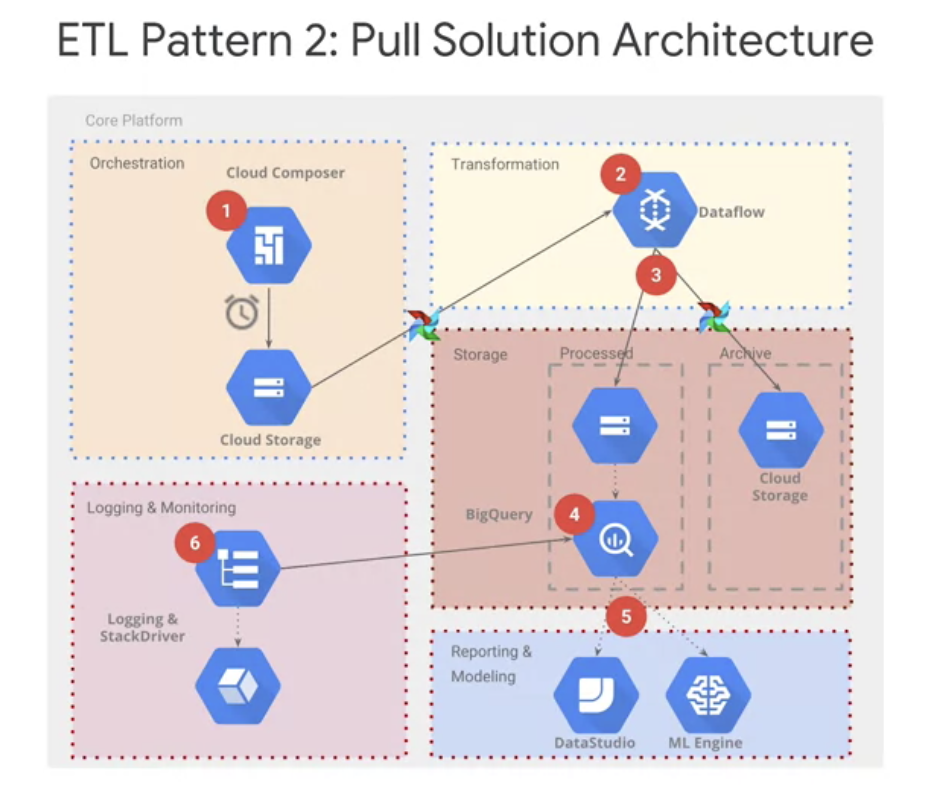

# Notes from Lectures, Labs and Readings

### ML Model Code counts for roughly 5% all code


### Other components in ML Production System


### Reuse other pieces of code


### Choosing where your data should be stored


### ETL Push Solution Architecture
- This architecture is best for those wanting ad hoc or invent based loading


### ETL Pull Solution Architecture
- Pull models are better for when there is a repeatable process and scheduled interval, instead of firing on-demand


The architecture for the pull model is very similar to the push model with the only difference being how the entire pipeline is invoked (between Cloud Composer and Cloud Functions). This pattern expects that the file will be waiting there to set schedule instead of starting upon an event. As you could have guessed, pull models are better for when there is a repeatable process and scheduled interval, instead of firing on-demand. 

### Serving ML Predictions in Batch and Real Time 
[serving_ml_prediction.ipynb](./labs/serving_ml_prediction.ipynb)
Downloaded from [here](https://github.com/GoogleCloudPlatform/training-data-analyst/blob/master/courses/machine_learning/deepdive2/production_ml/labs/serving_ml_prediction.ipynb)

#### Linux/bash Commands
- `|` = In bash the | (pipe) symbol takes the output from one command and uses it as the input for the next command. What you are doing here is using curl to retrieve the `install.sh` file and then output its contents into bash, which is a shell that will execute the contents of `install.sh`. In short, you are downloading and running the `install.sh` script, e.g `curl https://raw.githubusercontent.com/creationix/nvm/v0.23.2/install.sh | bash`
- `grep` - print lines matching a pattern e.g `grep [OPTIONS] PATTERN [FILE...]`
- `ls -r` option flag lists files/directories in reverse order, e.g `ls -r [options] [file|dir]`
- `-R, -r, --recursive`Read all files under each directory, recursively; this is equivalent to the `-d -recurse` option.

#### Creating a bucket and copy trained model in it
```
%%bash
if ! gsutil ls -r gs://${BUCKET} | grep -q gs://${BUCKET}/babyweight/trained_model/; then
    gsutil mb -l ${REGION} gs://${BUCKET}
    # copy canonical model if you didn't do previous notebook
    # TODO
    gsutil -m cp -R gs://cloud-training-demos/babyweight/trained_model gs://${BUCKET}/babyweight
fi
```

#### Deploy trained model
`gcloud ai-platform models create` [bash function](https://cloud.google.com/sdk/gcloud/reference/ai-platform/versions/create)

```
%%bash
# Set necessary variables: 
MODEL_NAME="babyweight"
MODEL_VERSION="ml_on_gcp"
MODEL_LOCATION=$(gsutil ls gs://${BUCKET}/babyweight/export/exporter/ | tail -1)

# Set the region to global by executing the following command: 
gcloud config set ai_platform/region global

echo "Deploying the model '$MODEL_NAME', version '$MODEL_VERSION' from $MODEL_LOCATION"
echo "... this will take a few minutes"

# Deploy trained model: 
  gcloud ai-platform models create ${MODEL_NAME} --regions $REGION
# Create a new AI Platform version.
# TODO
gcloud ai-platform versions create ${MODEL_VERSION} \
  --model ${MODEL_NAME} \
  --origin ${MODEL_LOCATION} \
  --runtime-version $TFVERSION
```

### Prediction service
In this section, you fix the code in BabyweightMLService.java and test it with the run\_once.sh script that is provided. If you need help with the code, look at the next section that provides hints on how to fix code in BabyweightMLService.java.

`BabyweightMLService.java` [file](./labs/BabyweightMLService.java) and [URL](https://github.com/GoogleCloudPlatform/training-data-analyst/blob/1074f954d44a6d65eb28069bba135b184eec14ac/courses/machine_learning/deepdive/06_structured/labs/serving/pipeline/src/main/java/com/google/cloud/training/mlongcp/BabyweightMLService.java)

