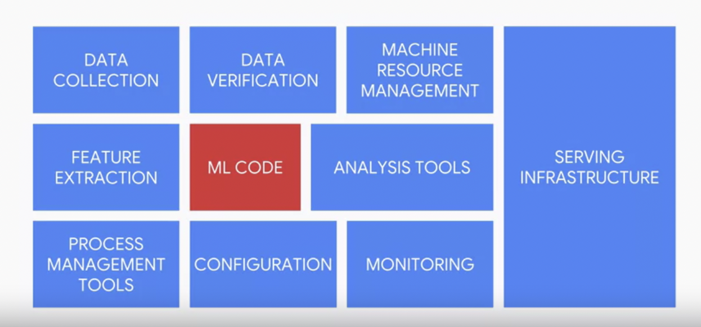
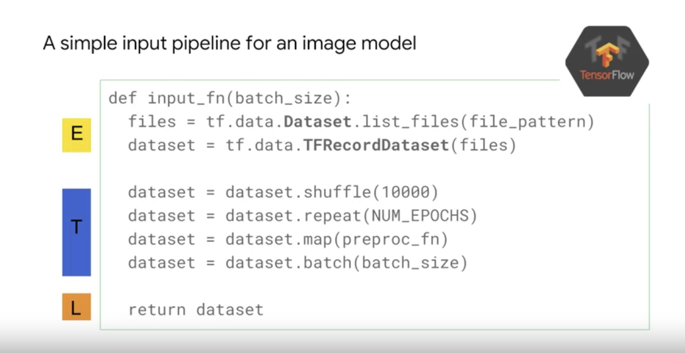

# Notes from Lectures, Labs and Readings

### ML Model Code counts for roughly 5% all code


### Other components in ML Production System


### Reuse other pieces of code


### Choosing where your data should be stored


### ETL Push Solution Architecture
- This architecture is best for those wanting ad hoc or invent based loading


### ETL Pull Solution Architecture
- Pull models are better for when there is a repeatable process and scheduled interval, instead of firing on-demand


The architecture for the pull model is very similar to the push model with the only difference being how the entire pipeline is invoked (between Cloud Composer and Cloud Functions). This pattern expects that the file will be waiting there to set schedule instead of starting upon an event. As you could have guessed, pull models are better for when there is a repeatable process and scheduled interval, instead of firing on-demand. 

### Serving ML Predictions in Batch and Real Time 
[serving_ml_prediction.ipynb](./labs/serving_ml_prediction.ipynb)
Downloaded from [here](https://github.com/GoogleCloudPlatform/training-data-analyst/blob/master/courses/machine_learning/deepdive2/production_ml/labs/serving_ml_prediction.ipynb)

#### Linux/bash Commands
- `|` = In bash the | (pipe) symbol takes the output from one command and uses it as the input for the next command. What you are doing here is using curl to retrieve the `install.sh` file and then output its contents into bash, which is a shell that will execute the contents of `install.sh`. In short, you are downloading and running the `install.sh` script, e.g `curl https://raw.githubusercontent.com/creationix/nvm/v0.23.2/install.sh | bash`
- `grep` - print lines matching a pattern e.g `grep [OPTIONS] PATTERN [FILE...]`
- `ls -r` option flag lists files/directories in reverse order, e.g `ls -r [options] [file|dir]`
- `-R, -r, --recursive`Read all files under each directory, recursively; this is equivalent to the `-d -recurse` option.

#### Creating a bucket and copy trained model in it
```
%%bash
if ! gsutil ls -r gs://${BUCKET} | grep -q gs://${BUCKET}/babyweight/trained_model/; then
    gsutil mb -l ${REGION} gs://${BUCKET}
    # copy canonical model if you didn't do previous notebook
    # TODO
    gsutil -m cp -R gs://cloud-training-demos/babyweight/trained_model gs://${BUCKET}/babyweight
fi
```

#### Deploy trained model
`gcloud ai-platform models create` [bash function](https://cloud.google.com/sdk/gcloud/reference/ai-platform/versions/create)

```
%%bash
# Set necessary variables: 
MODEL_NAME="babyweight"
MODEL_VERSION="ml_on_gcp"
MODEL_LOCATION=$(gsutil ls gs://${BUCKET}/babyweight/export/exporter/ | tail -1)

# Set the region to global by executing the following command: 
gcloud config set ai_platform/region global

echo "Deploying the model '$MODEL_NAME', version '$MODEL_VERSION' from $MODEL_LOCATION"
echo "... this will take a few minutes"

# Deploy trained model: 
  gcloud ai-platform models create ${MODEL_NAME} --regions $REGION
# Create a new AI Platform version.
# TODO
gcloud ai-platform versions create ${MODEL_VERSION} \
  --model ${MODEL_NAME} \
  --origin ${MODEL_LOCATION} \
  --runtime-version $TFVERSION
```

### Prediction service
In this section, you fix the code in BabyweightMLService.java and test it with the run\_once.sh script that is provided. If you need help with the code, look at the next section that provides hints on how to fix code in BabyweightMLService.java.

`BabyweightMLService.java` [file](./labs/BabyweightMLService.java) and [URL](https://github.com/GoogleCloudPlatform/training-data-analyst/blob/1074f954d44a6d65eb28069bba135b184eec14ac/courses/machine_learning/deepdive/06_structured/labs/serving/pipeline/src/main/java/com/google/cloud/training/mlongcp/BabyweightMLService.java)


**Conclusion**
So there you have it, our solution for mitigating training serving skew through code. We mitigated this problem by using polymorphism. Implementing the parts of the pipeline that don't change within a single parent class called InputOutput.java and then implementing the parts of the code that do need to change in separate child classes which were enforced via a contract in the parent class

### Tensorflow Records (TFRecords)
Apache Beam


Apache Spark


## Notes from Parallel Pipelines




## Data Parallelism


## Parameter Server Approach


## Inference
For streaming pipelines, the SavedModel approach is the fastest. Using mini-batching, as we recommended earlier in the module on implementing serving, helps reduce the gap between the TensorFlow Serving, HTTP endpoint approach, supported by Cloud ML Engine, and directly loading the model into the client. However, the Cloud ML Engine approach is much more maintainable, especially when the model will be used for multiple clients. Another thing to keep in mind is that as the number of queries per second keeps increasing, at some points the saved model approach will become infeasible. But the Cloud ML Engine approach should scale indefinitely. 


## Running ML Pipelines on Kubeflow
You deploy Kubeflow Pipelines as a Kuberenetes App, which are solutions with simple click to deploy to Google Kubernetes Engine and that have the flexibility to deploy to Kubernetes clusters on-premises or in third-party clouds. You will see Kubeflow Pipelines integrated into your Google Cloud environment as AI Platform Pipelines. If interested, learn more about [Kubeflow Pipelines](https://www.kubeflow.org/docs/components/pipelines/overview/pipelines-overview/) in the documentation during installation steps.


1. Open the Cloud Shell and enter the following command to create the required GKE cluster:
```
gcloud container clusters create cluster-1 --zone us-central1-a --cluster-version 1.18.20 --machine-type n1-standard-2 --enable-basic-auth --scopes=https://www.googleapis.com/auth/cloud-platform
```

- When the cluster is complete the cloud shell will show a status similar to the image below
- Return to the AI Platform grouping and click Pipelines
- Click New Instance.
- Click Configure.
- The cluster you created in Step 2 will appear by default in the selection window
- Scroll to the bottom of the page, if required accept the marketplace terms, and click Deploy. You will see the individual services of KFP deployed to your GKE cluster. Wait for the deployment to finish before proceeding to the next task.

2. Run an example pipeline

- In the Google Cloud Console, on the Navigation menu, click AI Platform > Pipelines.
- You will see the newly created Pipelines instance. If needed, click Refresh to update the page.
- Click on the OPEN PIPELINES DASHBOARD link next to your instance name.
- On the new page that loads, on the Navigation Menu on the left, click on Pipelines.
- You will see a list of pipelines that have been provided for demo and tutorial purposes. For this lab, you will use the [Demo XGBoost - Iterative model training sample pipeline. This sample demonstrates continuous training using a train-eval-check recursive loop, in which the model is trained iteratively until the model evaluation metrics are adequate.
- Click on the [Demo] XGBoost - Iterative model training pipeline.
- When it loads, you can see what the graph for this pipeline looks like. Next, you will create a run to test this pipeline.
- Click on Create experiment on the top right to associate a new experiment for the run.
- Enter the name my-first-experiment in the form that loads, and then click Next.
- Leave the default options, and click Start to run the pipeline. The pipeline run may take a few minutes to complete.
- You can click Refresh to update the page and see the latest status.
- Once the pipeline run has finished, you can click on the run name to see the fully generated graph as well as performance metrics and graphs.
- The green check marks means every part of the pipeline ran successfully. You can click on any box and see the outputs for that part like input/output, visualizations, logs, events, etc.