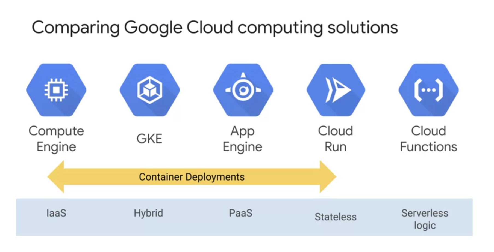
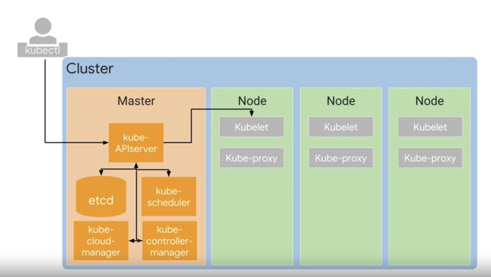

# Notes from Lectures, Labs and Readings

### Demo Readme Template Code


### Demo Readme Template Code
[serving_ml_prediction.ipynb](./labs/serving_ml_prediction.ipynb)
Downloaded from [here](https://github.com/GoogleCloudPlatform/training-data-analyst/blob/master/courses/machine_learning/deepdive2/production_ml/labs/serving_ml_prediction.ipynb)

# Working with Cloud Build
#### Linux/bash Commands
- `cat` displays file in terminal 
- `nano` editor for file

## Building Containers with DockerFile and Cloud Build

1. Activate Cloud Shell.
2. Create an empty `quickstart.sh` file using the nano text editor.
```
nano quickstart.sh
```
3. Add the following lines in to the quickstart.sh file:
```
#!/bin/sh
echo "Hello, world! The time is $(date)."
```
Save the file and close nano
4. Create an empty Dockerfile file using the nano text editor.
```
nano Dockerfile
```
add
```
FROM alpine
COPY quickstart.sh /
CMD ["/quickstart.sh"]
```
5. In Cloud Shell, run the following command to make the quickstart.sh script executable.
```
chmod +x quickstart.sh
```
6. In Cloud Shell, run the following command to build the Docker container image in Cloud Build.
```
gcloud builds submit --tag gcr.io/${GOOGLE_CLOUD_PROJECT}/quickstart-image .
```
Important:
- Don't miss the dot (".") at the end of the command. The dot specifies that the source code is in the current working directory at build time
7. In the Google Cloud Console, on the Navigation menu (Navigation menu), click Container Registry > Images.

## Building Containers with a build configuration file and Cloud Build
1. Create a soft link as a shortcut to the working [directory](https://github.com/GoogleCloudPlatform/training-data-analyst/tree/master/courses/ak8s/v1.1/Cloud_Build/a)
```
ln -s ~/training-data-analyst/courses/ak8s/v1.1 ~/ak8s
```
2. Change to the directory that contains the sample files for this lab.
```
cd ~/ak8s/Cloud_Build/a
```
3. In Cloud Shell, execute the following command to start a Cloud Build using cloudbuild.yaml as the build configuration file:
```
gcloud builds submit --config cloudbuild.yaml .
```

### Compute Solution Comparisons


### Compute Solution Summary


### Kubernetes Control Plane
