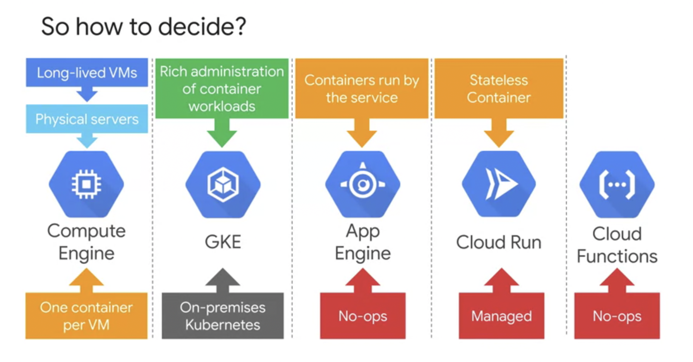
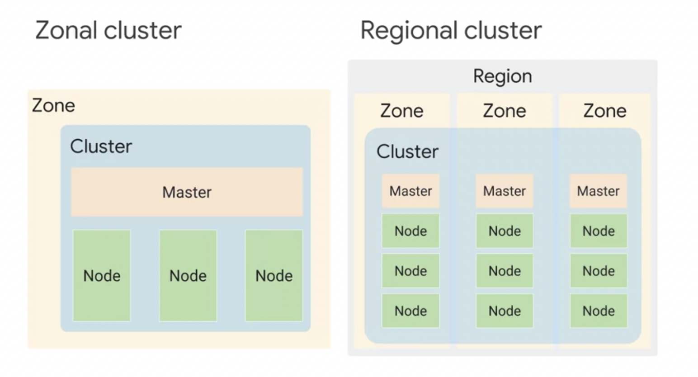
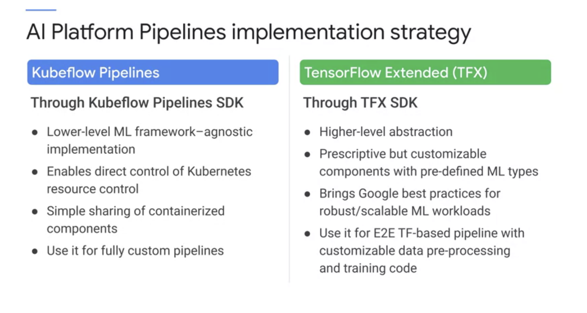

# Notes from Lectures, Labs and Readings

### Demo Readme Template Code


### Demo Readme Template Code
[serving_ml_prediction.ipynb](./labs/serving_ml_prediction.ipynb)
Downloaded from [here](https://github.com/GoogleCloudPlatform/training-data-analyst/blob/master/courses/machine_learning/deepdive2/production_ml/labs/serving_ml_prediction.ipynb)

# Working with Cloud Build
#### Linux/bash Commands
- `cat` displays file in terminal 
- `nano` editor for file

## Building Containers with DockerFile and Cloud Build

1. Activate Cloud Shell.
2. Create an empty `quickstart.sh` file using the nano text editor.
```
nano quickstart.sh
```
3. Add the following lines in to the quickstart.sh file:
```
#!/bin/sh
echo "Hello, world! The time is $(date)."
```
Save the file and close nano
4. Create an empty Dockerfile file using the nano text editor.
```
nano Dockerfile
```
add
```
FROM alpine
COPY quickstart.sh /
CMD ["/quickstart.sh"]
```
5. In Cloud Shell, run the following command to make the quickstart.sh script executable.
```
chmod +x quickstart.sh
```
6. In Cloud Shell, run the following command to build the Docker container image in Cloud Build.
```
gcloud builds submit --tag gcr.io/${GOOGLE_CLOUD_PROJECT}/quickstart-image .
```
Important:
- Don't miss the dot (".") at the end of the command. The dot specifies that the source code is in the current working directory at build time
7. In the Google Cloud Console, on the Navigation menu (Navigation menu), click Container Registry > Images.

## Building Containers with a build configuration file and Cloud Build
1. Create a soft link as a shortcut to the working [directory](https://github.com/GoogleCloudPlatform/training-data-analyst/tree/master/courses/ak8s/v1.1/Cloud_Build/a)
```
ln -s ~/training-data-analyst/courses/ak8s/v1.1 ~/ak8s
```
2. Change to the directory that contains the sample files for this lab.
```
cd ~/ak8s/Cloud_Build/a
```
3. In Cloud Shell, execute the following command to start a Cloud Build using cloudbuild.yaml as the build configuration file:
```
gcloud builds submit --config cloudbuild.yaml .
```

### Compute Solution Comparisons


### Compute Solution Summary


### Kubernetes Control Plane


### GKE Zonal vs Regional Cluster


### GKE Private Cluster


### Ways to create deployments
Describe Deployment Command/Linux


Deployment Config Output Command/Linux


Autoscaling


### AI Platform Pipelines

Tech stack


Implementation Strategy



Instance


Power of Reusable Pipelines


System Overview


## Using custom containers with AI Platform Training
### Enable Cloud Services
1. In Cloud Shell, to set the project ID to your Google Cloud Project, run the following command:
```
export PROJECT_ID=$(gcloud config get-value core/project)
gcloud config set project $PROJECT_ID
```
2. To enable the required Cloud services, run the following commands:
```
gcloud services enable \
cloudbuild.googleapis.com \
container.googleapis.com \
cloudresourcemanager.googleapis.com \
iam.googleapis.com \
containerregistry.googleapis.com \
containeranalysis.googleapis.com \
ml.googleapis.com \
dataflow.googleapis.com
```
3. Add the Editor permission for your Cloud Build service account:
```
PROJECT_NUMBER=$(gcloud projects describe $PROJECT_ID --format="value(projectNumber)")
CLOUD_BUILD_SERVICE_ACCOUNT="${PROJECT_NUMBER}@cloudbuild.gserviceaccount.com"
gcloud projects add-iam-policy-binding $PROJECT_ID \
  --member serviceAccount:$CLOUD_BUILD_SERVICE_ACCOUNT \
  --role roles/editor
```
### Create an instance of AI Platform Pipelines
1. Go to [Pipelines](https://console.cloud.google.com/marketplace/kubernetes/config/google-cloud-ai-platform/kubeflow-pipelines) and create a GKE Cluster if there is not already one there
2. Then click `Deploy` 

### Create an instance of Vertex AI Platform Notebooks
An instance of Vertex AI Platform Notebooks is used as a primary experimentation/development workbench. The instance is configured using a custom container image that includes all Python packages required for this lab.
1. In Cloud Shell, create a folder in your home directory:
```
cd
mkdir tmp-workspace
cd tmp-workspace
```
2. Create a requirements file with the Python packages to install in the custom image:
```
gsutil cp gs://cloud-training/OCBL203/requirements.txt .
```
3. Create a Dockerfile that defines your custom container image:
```
gsutil cp gs://cloud-training/OCBL203/Dockerfile .  
```
4. Build the image and push it to your project's Container Registry:
```
IMAGE_NAME=kfp-dev
TAG=latest
IMAGE_URI="gcr.io/${PROJECT_ID}/${IMAGE_NAME}:${TAG}"
gcloud builds submit --timeout 15m --tag ${IMAGE_URI} .
```

5. Create an instance of Vertex AI Platform Notebooks:
```
ZONE=us-central1-a
INSTANCE_NAME=ai-notebook
```
If you want to use a different ZONE and INSTANCE_NAME, replace us-central1-a with the zone of your choice as [YOUR_ZONE] and replace ai-notebook with the instance name of your choice as [YOUR_INSTANCE_NAME].
```
IMAGE_FAMILY="common-container"
IMAGE_PROJECT="deeplearning-platform-release"
INSTANCE_TYPE="n1-standard-4"
METADATA="proxy-mode=service_account,container=$IMAGE_URI"
gcloud compute instances create $INSTANCE_NAME \
  --zone=$ZONE \
  --image-family=$IMAGE_FAMILY \
  --machine-type=$INSTANCE_TYPE \
  --image-project=$IMAGE_PROJECT \
  --maintenance-policy=TERMINATE \
  --boot-disk-device-name=${INSTANCE_NAME}-disk \
  --boot-disk-size=100GB \
  --boot-disk-type=pd-ssd \
  --scopes=cloud-platform,userinfo-email \
  --metadata=$METADATA
```

This may take up to 5 minutes to complete.

After five minutes, in the Cloud Console, on the Navigation menu, click Vertex AI > Notebooks. The notebook instance you created in the previous step will be listed.

Click the Open Jupyterlab link.

### Clone the mlops-on-gcp repo within your Vertex AI Platform Notebooks instance
```
cd home/jupyter
```

```
git clone https://github.com/GoogleCloudPlatform/mlops-on-gcp
```


### Notebook Location
[lab-01.ipyn](./labs/lab-01.ipynb)
Downloaded from [here](https://github.com/GoogleCloudPlatform/mlops-on-gcp/blob/master/on_demand/kfp-caip-sklearn/lab-01-caip-containers/exercises/lab-01.ipynb)

**Really good detail, please refer to Notebook Location to see notes**

Using custom containers with AI Platform Training
Learning Objectives:

- Learn how to create a train and a validation split with BigQuery
- Learn how to wrap a machine learning model into a Docker container and train in on AI Platform
- Learn how to use the hyperparameter tunning engine on Google Cloud to find the best - hyperparameters
- Learn how to deploy a trained machine learning model Google Cloud as a rest API and query it
- In this lab, you develop a multi-class classification model, package the model as a docker image, and run on AI Platform Training as a training application. The training application trains a multi-class classification model that predicts the type of forest cover from cartographic data. The dataset used in the lab is based on Covertype Data Set from UCI Machine Learning Repository.

Scikit-learn is one of the most useful libraries for machine learning in Python. The training code uses scikit-learn for data pre-processing and modeling.

The code is instrumented using the `hypertune` package so it can be used with AI Platform hyperparameter tuning job in searching for the best combination of hyperparameter values by optimizing the metrics you specified.
