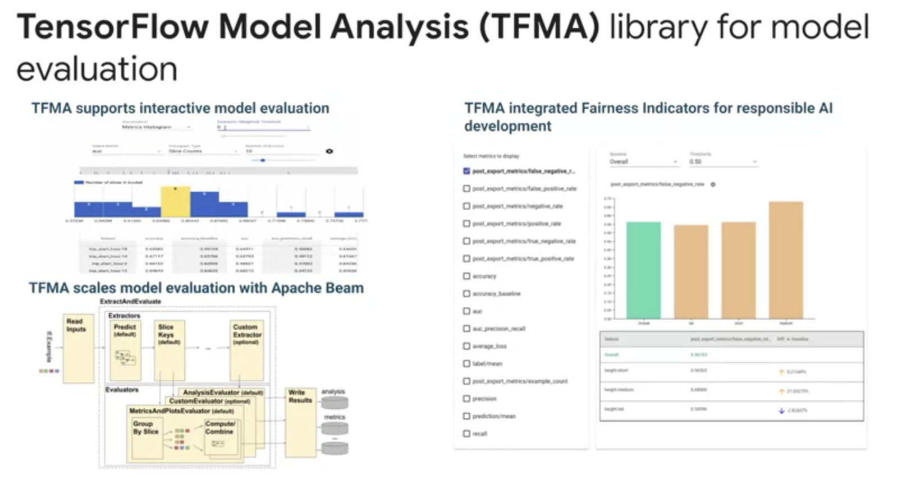
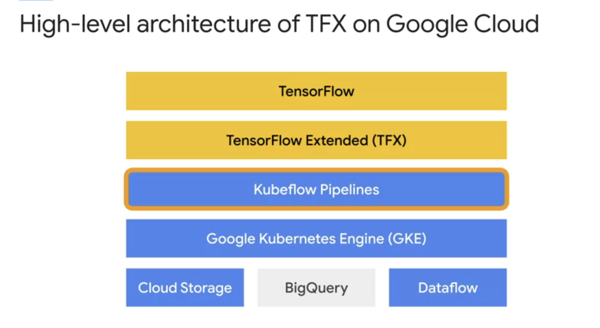
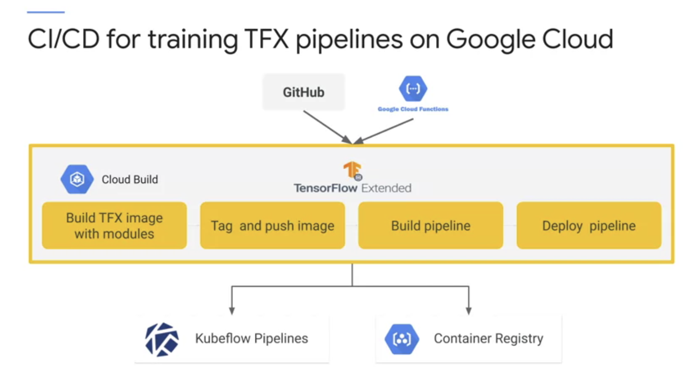
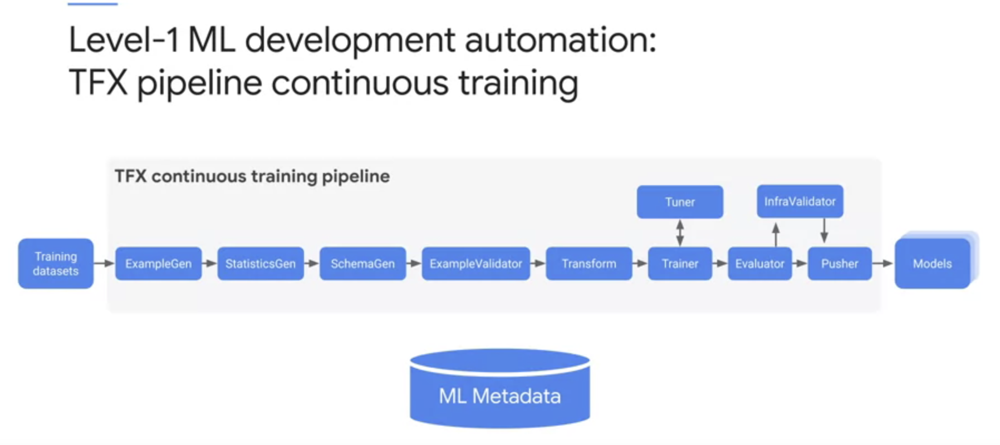
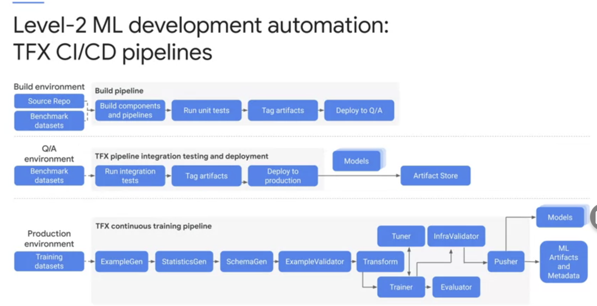
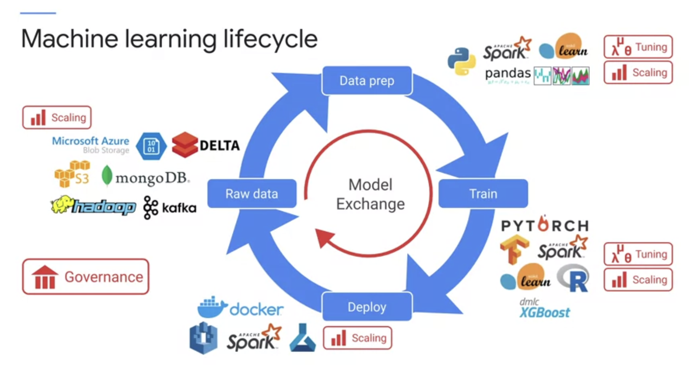
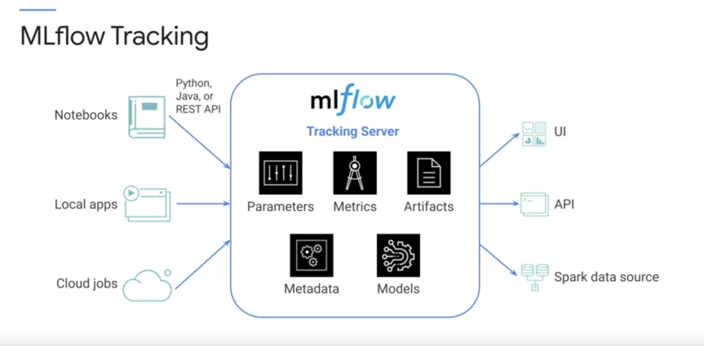
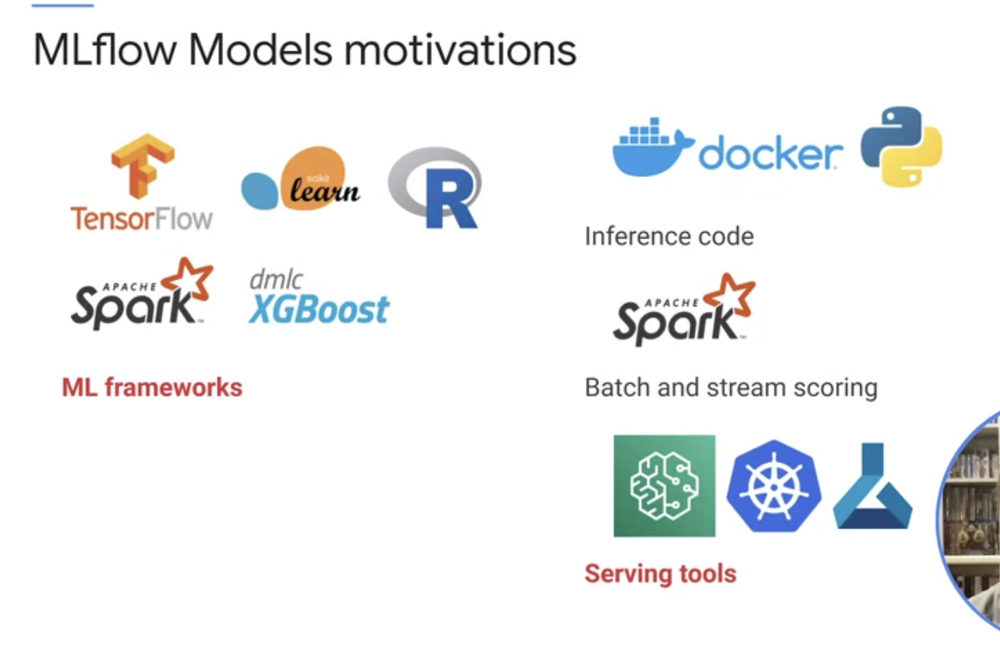
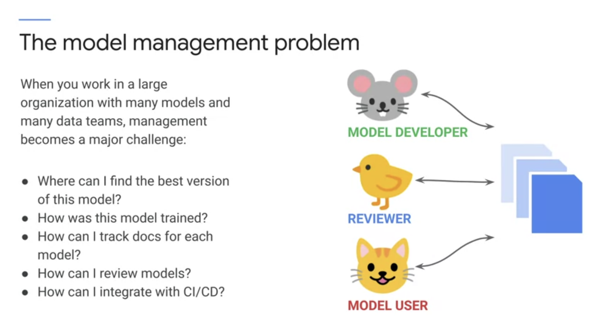

# Notes from Lectures, Labs and Readings

### Demo Readme Template Code


### Demo Readme Template Code
[serving_ml_prediction.ipynb](./labs/serving_ml_prediction.ipynb)
Downloaded from [here](https://github.com/GoogleCloudPlatform/training-data-analyst/blob/master/courses/machine_learning/deepdive2/production_ml/labs/serving_ml_prediction.ipynb)


# TensorFlow Extended (TFX) Overview


### TensorFlow Pipelines


# TFX Library Overview
 

## TensorFlow Standard Data Components
1. 
2. 
3. 
4. 
5. 
6. 

## TensorFlow Standard Model Components
1. 
2. 
3. 
4. 
5. 
6. 
7. 

TensorFlow Model Analysis (TFMA)


## TensorFlow Custom Components
[ComponentSpec](https://www.tensorflow.org/tfx/guide/custom_component#componentspec)

The ComponentSpec class defines the component contract by defining the input and output artifacts to a component as well as the parameters that are used for the component execution. There are three parts in it:
- INPUTS: A dictionary of typed parameters for the input artifacts that are into the component executor. Normally input artifacts are the outputs from upstream components and thus share the same type.
- OUTPUTS: A dictionary of typed parameters for the output artifacts which the component produces.
- PARAMETERS: A dictionary of additional ExecutionParameter items that will be passed into the component executor. These are non-artifact parameters that we want to define flexibly in the pipeline DSL and pass into execution.

## TFX Standard Components Walkthrough
[lab-01.ipynb](./labs/lab-01.ipynb). Need to run this to create files used in this lab
```
cd mlops-on-gcp/workshops/tfx-caip-tf23
./install.sh
```

## Learning Objectives

1.  Develop a high level understanding of TFX pipeline components.
2.  Learn how to use a TFX Interactive Context for prototype development of TFX pipelines.
3.  Work with the Tensorflow Data Validation (TFDV) library to check and analyze input data.
4.  Utilize the Tensorflow Transform (TFT) library for scalable data preprocessing and feature transformations.
5.  Employ the Tensorflow Model Analysis (TFMA) library for model evaluation.

In this lab, you will work with the [Covertype Data Set](https://github.com/jarokaz/mlops-labs/blob/master/datasets/covertype/README.md) and use TFX to analyze, understand, and pre-process the dataset and train, analyze, validate, and deploy a multi-class classification model to predict the type of forest cover from cartographic features.

You will utilize  **TFX Interactive Context** to work with the TFX components interactivelly in a Jupyter notebook environment. Working in an interactive notebook is useful when doing initial data exploration, experimenting with models, and designing ML pipelines. You should be aware that there are differences in the way interactive notebooks are orchestrated, and how they access metadata artifacts. In a production deployment of TFX on GCP, you will use an orchestrator such as Kubeflow Pipelines, or Cloud Composer. In an interactive mode, the notebook itself is the orchestrator, running each TFX component as you execute the notebook cells. In a production deployment, ML Metadata will be managed in a scalabe database like MySQL, and artifacts in apersistent store such as Google Cloud Storage. In an interactive mode, both properties and payloads are stored in a local file system of the Jupyter host.

**Setup Note:**
Currently, TFMA visualizations do not render properly in JupyterLab. It is recommended to run this notebook in Jupyter Classic Notebook. To switch to Classic Notebook select *Launch Classic Notebook* from the *Help* menu.

## Next steps

This concludes your introductory walthrough through TFX pipeline components. In the lab, you used TFX to analyze, understand, and pre-process the dataset and train, analyze, validate, and deploy a multi-class classification model to predict the type of forest cover from cartographic features. You utilized a TFX Interactive Context for prototype development of a TFX pipeline directly in a Jupyter notebook. Next, you worked with the TFDV library to modify your dataset schema to add feature constraints to catch data anamolies that can negatively impact your model's performance. You utilized TFT library for feature proprocessing for consistent feature transformations for your model at training and serving time. Lastly, using the TFMA library, you added model performance constraints to ensure you only push more accurate models than previous runs to production.

The next labs in the series will guide through developing a TFX pipeline, deploying and running the pipeline on **AI Platform Pipelines** and automating the pipeline build and deployment processes with **Cloud Build**.

## Pipeline Orchestration with TFX


## Apache Beam TFX Relationship 


## TFX on Google Cloud



## TFX on Cloud AI Platform Pipelines 
[lab-02.ipynb](./labs/lab2/lab-02.ipynb). Need to run this to create files used in this lab
```
cd mlops-on-gcp/workshops/tfx-caip-tf23
./install.sh
```

In this lab, you learned how to manually build and deploy a TFX pipeline to AI Platform Pipelines and trigger pipeline runs from a notebook

### Overview
In this lab, you use utilize the following tools and services to deploy and run a TFX pipeline on Google Cloud that automates the development and deployment of a TensorFlow 2.3 WideDeep Classifer to predict forest cover from cartographic data:
- The TFX CLI utility to build and deploy a TFX pipeline.
- A hosted AI Platform Pipeline instance (Kubeflow Pipelines) for TFX pipeline orchestration.
- Dataflow jobs for scalable, distributed data processing for TFX components.
- A AI Platform Training job for model training and flock management for parallel tuning trials.
- AI Platform Prediction as a model server destination for blessed pipeline model versions.
- CloudTuner and AI Platform Vizier for advanced model hyperparameter tuning using the Vizier algorithm.
- You will then create and monitor pipeline runs using the TFX CLI as well as the KFP UI.

### Objectives
- Use the TFX CLI to build a TFX pipeline.
- Deploy a TFX pipeline version without tuning to a hosted AI Platform Pipelines instance.
- Create and monitor a TFX pipeline run using the TFX CLI.
- Deploy a new TFX pipeline version with tuning enabled to a hosted AI Platform Pipelines instance.
- Create and monitor another TFX pipeline run directly in the KFP UI.

## TFX Pipeline Design Pattern


## TFX Pipeline as Docker Container


## CI/CD for training TFX Pipelines on Google Cloud


## Pipeline Automation Steps
### Level 0 - TFX Pipeline Notebook Prototyping


### Level 1 TFX Pipeline Continous Training


### Level 2 TFX CI/CD Pipelines


### end_to_end_tfx_mlops_workflow


### future_developments_feature_store


## Git [forks](https://docs.github.com/en/get-started/quickstart/fork-a-repo)

Most commonly, forks are used to either propose changes to someone else's project or to use someone else's project as a starting point for your own idea. You can fork a repository to create a copy of the repository and make changes without affecting the upstream repository. For more information, see "Working with forks."
Propose changes to someone else's project

For example, you can use forks to propose changes related to fixing a bug. Rather than logging an issue for a bug you've found, you can:
- Fork the repository.
- Make the fix.
- Submit a pull request to the project owner.

## [Building repositories](https://cloud.google.com/build/docs/automating-builds/build-repos-from-github) from GitHub 

GitHub triggers enable you to automatically build on Git pushes and pull requests and view your build results on GitHub and Cloud Console. Additionally, GitHub triggers support all the features supported by the existing GitHub triggers and use the Cloud Build GitHub app to configure and authenticate to GitHub.

This page explains how to create GitHub triggers and build on GitHub using the Cloud Build GitHub app.

## TFX on Cloud AI Platform Pipelines 
[lab-03.ipynb](./labs/lab-03.ipynb). Need to run this to create files used in this lab
```
cd mlops-on-gcp/workshops/tfx-caip-tf23
./install.sh
```

Objectives:
- Develop a CI/CD workflow with Cloud Build to build and deploy a machine learning pipeline.
- Integrate with Github to trigger workflows with pipeline source repository changes.

In this lab, you walked through authoring a Cloud Build CI/CD workflow that automatically builds and deploys a TFX pipeline. You also integrated your TFX workflow with GitHub by setting up a Cloud Build trigger. In the next lab, you will walk through inspection of TFX metadata and pipeline artifacts created during TFX pipeline runs.

# TFX Pipeline Metadata


## TFX Metadata  
[lab-04.ipynb](./labs/lab-04.ipynb). Need to run this to create files used in this lab
```
cd mlops-on-gcp/workshops/tfx-caip-tf23
./install.sh
```

In this lab, you will explore TFX pipeline metadata including pipeline and run artifacts. An AI Platform Pipelines instance includes the ML Metadata service. In AI Platform Pipelines, ML Metadata uses MySQL as a database backend and can be accessed using a GRPC server.

Objectives
- Use a GRPC server to access and analyze pipeline artifacts stored in the ML Metadata service of your AI Platform Pipelines instance

In this lab, you explored ML metadata and ML artifacts created by TFX pipeline runs using TFX pipeline ResolverNodes.

## Exploring ML Metadata 

The Metadata Store uses the following data model:

- `ArtifactType` describes an artifact's type and its properties that are stored in the Metadata Store. These types can be registered on-the-fly with the Metadata Store in code, or they can be loaded in the store from a serialized format. Once a type is registered, its definition is available throughout the lifetime of the store.
- `Artifact` describes a specific instances of an ArtifactType, and its properties that are written to the Metadata Store.
- `ExecutionType` describes a type of component or step in a workflow, and its runtime parameters.
- `Execution` is a record of a component run or a step in an ML workflow and the runtime parameters. An Execution can be thought of as an instance of an ExecutionType. Every time a developer runs an ML pipeline or step, executions are recorded for each step.
- `Event` is a record of the relationship between an Artifact and Executions. When an Execution happens, Events record every Artifact that was used by the Execution, and every Artifact that was produced. These records allow for provenance tracking throughout a workflow. By looking at all Events MLMD knows what Executions happened, what Artifacts were created as a result, and can recurse back from any Artifact to all of its upstream inputs.
- `ContextType` describes a type of conceptual group of Artifacts and Executions in a workflow, and its structural properties. For example: projects, pipeline runs, experiments, owners.
- `Context` is an instances of a ContextType. It captures the shared information within the group. For example: project name, changelist commit id, experiment annotations. It has a user-defined unique name within its ContextType.
- `Attribution` is a record of the relationship between Artifacts and Contexts.
- `Association` is a record of the relationship between Executions and Contexts.

# Continous Training with multiple SKK's, Kubeflow & AI Platform Pipelines
## Containerised Training Applications


## Continuous Training


## Lab: Continuous Training with TensorFlow, PyTorch, XGBoost, and Scikit-learn Models with KubeFlow and AI Platform Pipelines
[multiple_frameworks_lab.ipynb](./labs/multiple_frameworks_lab.ipynb). Downloaded from [here](https://github.com/GoogleCloudPlatform/mlops-on-gcp/blob/1a5b4732673e2b45a18c6c758a831845005fe435/continuous_training/kubeflow/labs/multiple_frameworks_lab.ipynb)

### Overview
In this lab we will create containerized training applications for ML models in TensorFlow, PyTorch, XGBoost, and Scikit-learn. Will will then use these images as ops in a KubeFlow pipeline and train multiple models in parallel. We will then set up recurring runs of our KubeFlow pipeline in the UI. 

First, we will containerize models in TF, PyTorch, XGBoost and Scikit-learn following a step-wise process for each:
* Create the training script
* Package training script into a Docker Image 
* Build and push training image to Google Cloud Container Registry

Once we have all four training images built and pushed to the Container Registry, we will build a KubeFlow pipeline that does two things:
* Queries BigQuery to create training/validation splits and export results as sharded CSV files in GCS
* Launches AI Platform training jobs with our four containerized training applications, using the exported CSV data as input 

Finally, we will compile and deploy our pipeline. In the UI we will set up Continuous Training with recurring pipeline runs.

**PRIOR TO STARTING THE LAB:** Make sure you create a new instance with AI Platform Pipelines. Once the GKE cluster is spun up, copy the endpoint because you will need it in this lab. 

### Objectives
- Create the training script
- Package training script into a Docker Image
- Build and push training image to Google Cloud Container Registry
- Build a Kubeflow pipeline that queries BigQuery to create training/validation splits and export results as sharded CSV files in GCS
- Launch AI Platform training jobs with the four containerized training applications, using the exported CSV data as input

In this lab you've learned how to you develop, package as a docker image, and run on AI Platform Training to training application.

### Lab Working
#### Enable Cloud Services

1. In Cloud Shell, run the command below to set the project id to your Google Cloud Project:
```
PROJECT_ID=[YOUR PROJECT ID]
gcloud config set project $PROJECT_ID
```
2. Next, execute the following commands to enable the required Cloud services:
```
gcloud services enable \
cloudbuild.googleapis.com \
container.googleapis.com \
cloudresourcemanager.googleapis.com \
iam.googleapis.com \
containerregistry.googleapis.com \
containeranalysis.googleapis.com \
ml.googleapis.com \
dataflow.googleapis.com
```
3. Add the Editor permission for your Cloud Build service account:
```
PROJECT_NUMBER=$(gcloud projects describe $PROJECT_ID --format="value(projectNumber)")
CLOUD_BUILD_SERVICE_ACCOUNT="${PROJECT_NUMBER}@cloudbuild.gserviceaccount.com"
gcloud projects add-iam-policy-binding $PROJECT_ID \
  --member serviceAccount:$CLOUD_BUILD_SERVICE_ACCOUNT \
  --role roles/editor
```

#### Create an instance of AI Platform Pipelines (**via GUI**)

#### Create an instance of AI Platform Notebooks

An instance of AI Platform Notebooks is used as a primary experimentation/development workbench. The instance is configured using a custom container image that includes all Python packages required for this lab. (**creates container image**)

1. In Cloud Shell, create a folder in your home directory:
```
cd
mkdir tmp-workspace
cd tmp-workspace
```
2. Create a requirements file with the Python packages to install in the custom image.
```
gsutil cp gs://cloud-training/OCBL203/requirements.txt .
```
3. Create a Dockerfile defining you custom container image.
```
gsutil cp gs://cloud-training/OCBL203/Dockerfile .  
```
4. Build the image and push it to your project's Container Registry
```
IMAGE_NAME=kfp-dev
TAG=latest
IMAGE_URI="gcr.io/${PROJECT_ID}/${IMAGE_NAME}:${TAG}"
gcloud builds submit --timeout 15m --tag ${IMAGE_URI} .
```
5. Create an instance of AI Platform Notebooks (**took a while to show in instances although it said it created it successfully**)
```
ZONE=[YOUR_ZONE]
INSTANCE_NAME=[YOUR_INSTANCE_NAME]
IMAGE_FAMILY="common-container"
IMAGE_PROJECT="deeplearning-platform-release"
INSTANCE_TYPE="n1-standard-4"
METADATA="proxy-mode=service_account,container=$IMAGE_URI"
gcloud compute instances create $INSTANCE_NAME \
  --zone=$ZONE \
  --image-family=$IMAGE_FAMILY \
  --machine-type=$INSTANCE_TYPE \
  --image-project=$IMAGE_PROJECT \
  --maintenance-policy=TERMINATE \
  --boot-disk-device-name=${INSTANCE_NAME}-disk \
  --boot-disk-size=100GB \
  --boot-disk-type=pd-ssd \
  --scopes=cloud-platform,userinfo-email \
  --metadata=$METADATA
```

#### Navigate to the lab notebook

In JupyterLab UI, navigate to mlops-on-gcp/continuous_training/kubeflow/labs and open multiple_frameworks_lab.ipynb.

Clear all the cells in the notebook (look for the Clear button on the notebook toolbar) and then Run the cells one by one. Note the some cells have a #TODO for you to write the code before you run the cell.

When prompted, come back to these instructions to check your progress.

If you need more help, you may take a look at the complete solution by navigating to mlops-on-gcp/continuous_training/kubeflow/solutions open multiple_frameworks_kubeflow.ipynb.

## Continuous Training Pipelines with Cloud Composer
[chicago_taxi_dag.py](./labs/chicago_taxi_dag.py). Downloaded from [here](https://github.com/GoogleCloudPlatform/mlops-on-gcp/blob/617a76a00a0a789eaff4bbb05c5aae1342a6b604/continuous_training/composer/solutions/chicago_taxi_dag.py)

### Overview
In this lab you will learn how to write an Airflow DAG for continuous training and deploy the DAG within a Cloud Composer environment. You will also learn how to explore and monitor your DAG runs using the Apache Airflow webserver.
Objectives

In this lab, you will learn to perform the following tasks:
- Provision a Cloud Composer environment.
- Deploy an Apache Airflow Dialog.
- Monitor a continuous training pipeline in the Airflow webserver.
- Explore Airflow logs using Cloud Operations.

#### Task 1. Provision Google Cloud Resources
In this task, you configure and deploy a Cloud Composer environment to run a fully-managed installation of Apache Airflow.

1. Run the following command to enable the required Cloud service:
```
gcloud services enable ml.googleapis.com
```
2. Download Code Repository
In the Cloud Shell terminal, run the following commands
```
git clone https://github.com/GoogleCloudPlatform/mlops-on-gcp
cd mlops-on-gcp/continuous_training/composer/labs/
ls
```
3. Provision Google Cloud Resources and Stage Trainer Package
In the Cloud Shell terminal, run the following command to create a regional Cloud Storage bucket in the us-central1 region:
```
export BUCKET_NAME=${DEVSHELL_PROJECT_ID}
export REGION=us-central1
gsutil mb -l ${REGION} gs://${BUCKET_NAME}
```
4. Compress the trainer package and copy to your Cloud Storage bucket by running the following commands:
```
tar -cvf trainer.tar chicago_taxifare
gsutil cp ./trainer.tar gs://${BUCKET_NAME}/chicago_taxi/code/
```
5. Create a Pub/Sub topic to receive messages from your Pub/Sub pipeline by running the following command:
```
gcloud pubsub topics create chicago-taxi-pipeline
```
6. Create a BigQuery dataset for storing preprocessed data for training and a table for storing training metrics by running the following commands:
```
bq mk -d chicago_taxi_ct
bq mk --table chicago_taxi_ct.model_metrics version_name:STRING,rmse:FLOAT
```
7. Create Cloud Composer environment
Create your Cloud Composer environment by running the following command in Cloud Shell:
```
gcloud composer environments create demo-environment \
  --location $REGION \
  --python-version 3
```

Task 3. Run DAG in Apache Airflow

In this task you will copy your newly completed DAG into a Cloud Storage bucket, which will be automatically synced with your Cloud Composer environment. Afterwards you will check that your DAG was loaded correctly and start a DAG run.
Check that Cloud Composer environment is ready.
- In the Google Clod Console, on the Navigation menu (Navigation menu), scroll down to the Big Data heading and click on Composer.
- You should see your Composer environment, demo-environment. If it is still being setup, then wait until that process is complete before moving on to the next step.

Define Airflow Variables
Return to Cloud Shell, and run the following command:
```
gcloud composer environments storage data import \
  --source vars.json \
  --environment demo-environment \
  --location $REGION
gcloud composer environments run demo-environment \
  --location $REGION variables \
  -- \
  --i /home/airflow/gcs/data/vars.json
```
Copy DAG into Cloud Storage bucket.
In Cloud Shell, and run the following commands:
```
DAGS_FOLDER=$(gcloud composer environments describe demo-environment \
   --location $REGION   --format="get(config.dagGcsPrefix)")
gsutil cp ./chicago_taxi_dag.py ${DAGS_FOLDER}/
```

Task 4. Exploring Your DAG Run in the Airflow UI
Accessing Airflow UI

To access the Airflow web interface using the GCP Console:
- Go back to the Environments page.
- In the Airflow webserver column for the environment, click Airflow.
- Click on your lab credentials.
- The Airflow web interface opens in a new browser window.

Exploring DAG runs

**When you upload your DAG file to the dags folder in Cloud Storage, Cloud Composer parses the file. If no errors are found, the name of the workflow appears in the DAG listing, and the workflow is queued to run immediately.**

Make sure that you're on the DAGs tab in the Airflow web interface. It takes several minutes for this process to complete. Refresh your browser to make sure you're looking at the latest information.
- In Airflow, click chicago_taxi_dag to open the DAG details page. This page includes several representations of the workflow tasks and dependencies.
- In the toolbar, click Graph View. Mouseover the graphic for each task to see its status. Note that the border around each task also indicates the status (green border = running; red = failed; pink = skipped, etc.).
- Click the "Refresh" link to make sure you're looking at the most recent information. The borders of the processes change colors as the state of the process changes
- Once the status for ml_engine_training_chicago_taxi_trips_task has changed to running, go to Navigation menu > AI Platform > Jobs and confirm the job is running. This job will take 10-15 minutes to complete.
- Once all the steps are complete in the DAG, each step has a dark green border or pink border (for tasks that were skipped)

# [mlflow](https://mlflow.org/)
## Overview



## 1. mlflow Tracking



## 2. mlflow Projects


## 3. mlflow Models



## 4. mlflow Registry



