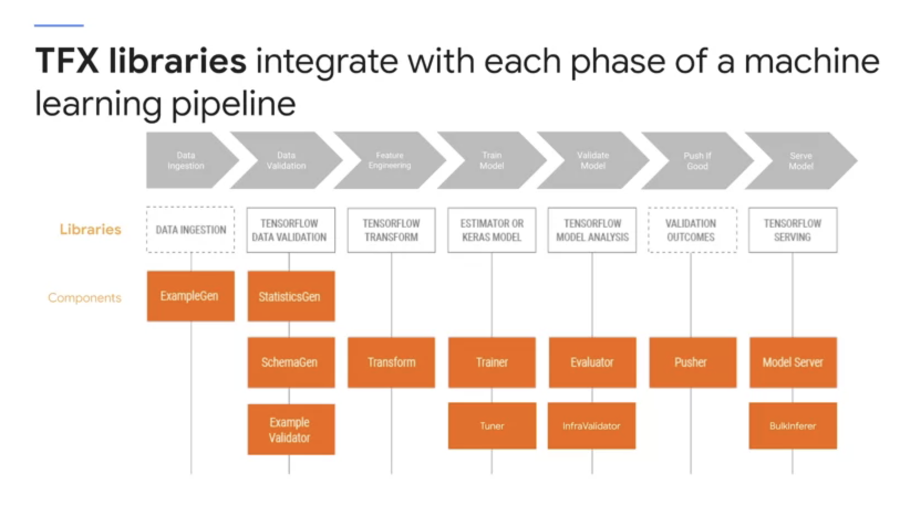

# Notes from Lectures, Labs and Readings

### Demo Readme Template Code


### Demo Readme Template Code
[serving_ml_prediction.ipynb](./labs/serving_ml_prediction.ipynb)
Downloaded from [here](https://github.com/GoogleCloudPlatform/training-data-analyst/blob/master/courses/machine_learning/deepdive2/production_ml/labs/serving_ml_prediction.ipynb)


# TensorFlow Extended (TFX) Overview


### TensorFlow Pipelines


# TFX Library Overview
 

## TensorFlow Standard Data Components
1. 
2. 
3. 
4. 
5. 
6. 

## TensorFlow Standard Model Components
1. 
2. 
3. 
4. 
5. 
6. 
7. 

TensorFlow Model Analysis (TFMA)


## TensorFlow Custom Components
[ComponentSpec](https://www.tensorflow.org/tfx/guide/custom_component#componentspec)

The ComponentSpec class defines the component contract by defining the input and output artifacts to a component as well as the parameters that are used for the component execution. There are three parts in it:
- INPUTS: A dictionary of typed parameters for the input artifacts that are into the component executor. Normally input artifacts are the outputs from upstream components and thus share the same type.
- OUTPUTS: A dictionary of typed parameters for the output artifacts which the component produces.
- PARAMETERS: A dictionary of additional ExecutionParameter items that will be passed into the component executor. These are non-artifact parameters that we want to define flexibly in the pipeline DSL and pass into execution.

## TFX Standard Components Walkthrough
[lab-01.ipynb](./labs/lab-01.ipynb). Need to run this to create files used in this lab
```
cd mlops-on-gcp/workshops/tfx-caip-tf23
./install.sh
```

## Learning Objectives

1.  Develop a high level understanding of TFX pipeline components.
2.  Learn how to use a TFX Interactive Context for prototype development of TFX pipelines.
3.  Work with the Tensorflow Data Validation (TFDV) library to check and analyze input data.
4.  Utilize the Tensorflow Transform (TFT) library for scalable data preprocessing and feature transformations.
5.  Employ the Tensorflow Model Analysis (TFMA) library for model evaluation.

In this lab, you will work with the [Covertype Data Set](https://github.com/jarokaz/mlops-labs/blob/master/datasets/covertype/README.md) and use TFX to analyze, understand, and pre-process the dataset and train, analyze, validate, and deploy a multi-class classification model to predict the type of forest cover from cartographic features.

You will utilize  **TFX Interactive Context** to work with the TFX components interactivelly in a Jupyter notebook environment. Working in an interactive notebook is useful when doing initial data exploration, experimenting with models, and designing ML pipelines. You should be aware that there are differences in the way interactive notebooks are orchestrated, and how they access metadata artifacts. In a production deployment of TFX on GCP, you will use an orchestrator such as Kubeflow Pipelines, or Cloud Composer. In an interactive mode, the notebook itself is the orchestrator, running each TFX component as you execute the notebook cells. In a production deployment, ML Metadata will be managed in a scalabe database like MySQL, and artifacts in apersistent store such as Google Cloud Storage. In an interactive mode, both properties and payloads are stored in a local file system of the Jupyter host.

**Setup Note:**
Currently, TFMA visualizations do not render properly in JupyterLab. It is recommended to run this notebook in Jupyter Classic Notebook. To switch to Classic Notebook select *Launch Classic Notebook* from the *Help* menu.

## Next steps

This concludes your introductory walthrough through TFX pipeline components. In the lab, you used TFX to analyze, understand, and pre-process the dataset and train, analyze, validate, and deploy a multi-class classification model to predict the type of forest cover from cartographic features. You utilized a TFX Interactive Context for prototype development of a TFX pipeline directly in a Jupyter notebook. Next, you worked with the TFDV library to modify your dataset schema to add feature constraints to catch data anamolies that can negatively impact your model's performance. You utilized TFT library for feature proprocessing for consistent feature transformations for your model at training and serving time. Lastly, using the TFMA library, you added model performance constraints to ensure you only push more accurate models than previous runs to production.

The next labs in the series will guide through developing a TFX pipeline, deploying and running the pipeline on **AI Platform Pipelines** and automating the pipeline build and deployment processes with **Cloud Build**.

## Pipeline Orchestration with TFX


## Apache Beam TFX Relationship 


## TFX on Google Cloud


