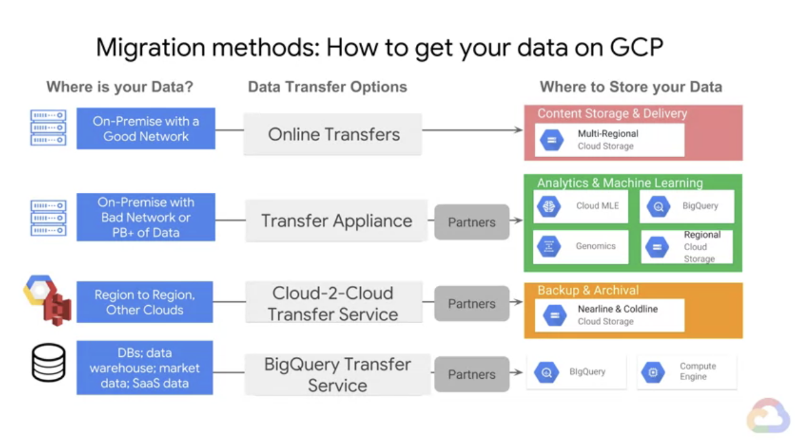

# course-notes
Shows notes i've made on my journey to `machine_learning_with_tensorflow_on_gcp_specialization`

If these notes help 1 person, i'll be happy! This is my attempt to give back to the open source community

Apologies if my earlier course notes aren't well laid out, I improved my note taking as I went on this journey. My favourite courses were [008_ml_ops](./008_ml_ops) & [009_ml_pipelines_on_gcp](./009_ml_pipelines_on_gcp).

### Navigation
Completed in this order
- [001_how_google_does_ml](./001_how_google_does_ml) Link to course [here](https://www.coursera.org/learn/google-machine-learning)
- [002_launching-machine-learning/labs](./002_launching-machine-learning/labs) Link to course [here](https://www.coursera.org/learn/launching-machine-learning)
- [003_intro-to-tensorflow/labs](./003_intro-to-tensorflow/labs) Link to course [here](https://www.coursera.org/learn/intro-tensorflow)
- [004_feature-engineering/labs](./004_feature-engineering/labs) Link to course [here](https://www.coursera.org/learn/feature-engineering)
- [005_art_and_science_of_ml](./005_art_and_science_of_ml) Link to course [here](https://www.coursera.org/learn/art-science-ml)
- [006_big_data_ml_fundamentals](./006_big_data_ml_fundamentals) Link to course [here](https://www.coursera.org/learn/gcp-big-data-ml-fundamentals)
- [007_production_ml_systems](./007_production_ml_systems) Link to course [here](https://www.coursera.org/learn/gcp-production-ml-systems)
- [008_ml_ops](./008_ml_ops) Link to course [here](https://www.coursera.org/learn/mlops-fundamentals)
- [009_ml_pipelines_on_gcp](./009_ml_pipelines_on_gcp) Link to course [here](https://www.coursera.org/learn/ml-pipelines-google-cloud)

### Search Items
- `handy-function` - handy function

### GCP Developer Cheat Sheet

### Highlighted Pictures
**Note:** The pictures below are screenshotted from the lecture notes. If you would like to know more information about a picture, please refer to the picture's `src` path and it will show which course it came from. There is a associated README within each course that may be helpful.

The pictures below start from `001_how_google_does_ml` and finish with `009_ml_pipelines_on_gcp`

*Goodfit*

*Overfitting*

*Underfitting 1/2*

*Underfitting 2/2*

*Under represented training dataset*

*Under represented validation dataset*

*Under represented validation dataset*

*Maturity Level 0*

*Maturity Level 1*

*Maturity Level 2*

